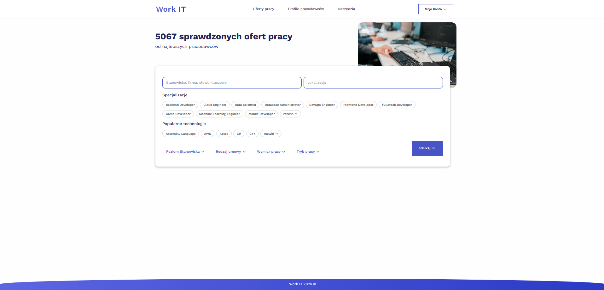
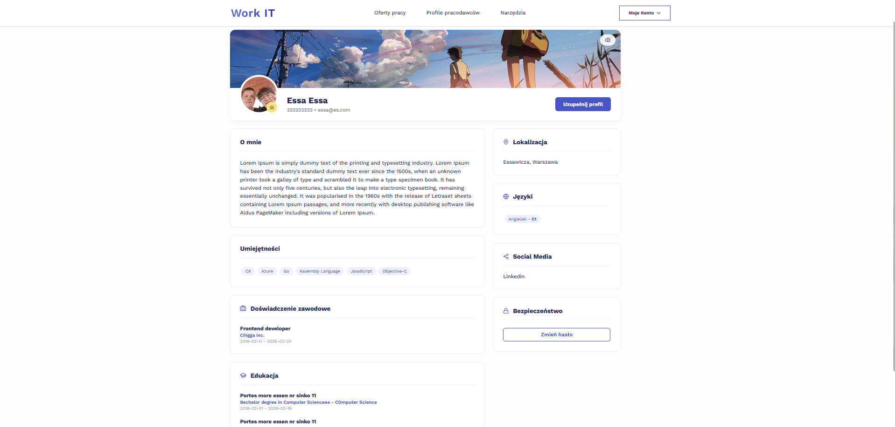
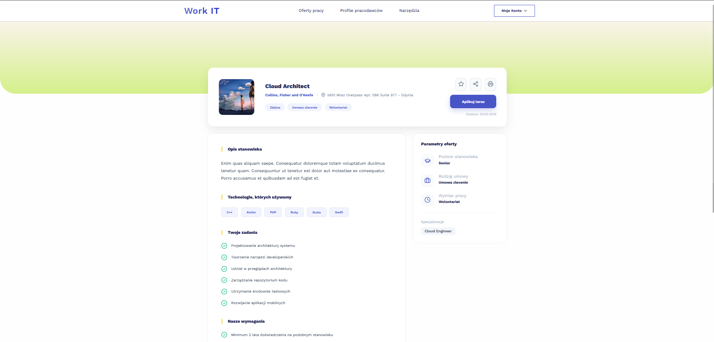

## **WorkIT** – Modern IT Job Board Platform
WorkIT is a full-stack job advertising platform inspired by sites like pracuj.pl. It features a decoupled architecture with an independent **Laravel-based REST API** and a dynamic **React SPA** (Single Page Application).

### Aim
The primary goal of this project was to master the data flow between a separated frontend and backend. It served as a hands-on learning experience for implementing **JWT-based authentication**, managing complex application states, and handling secure, dynamic routing.

### Key features
* **Job Listings Management:** Browse, post, and manage IT job offers.
* **JWT Authentication:** Secure user registration and login system with token-based persistence.
* **Dynamic Routing:** Seamless navigation without page reloads using React Router.
* **Responsive Design:** A custom-styled interface built with SCSS for a modern look and feel.
* **Decoupled Architecture:** A clear separation between the server-side API and the client-side UI.

### Challenges
* **Authentication Persistence:** Maintaining user sessions across page refreshes in a decoupled environment.
    * **Solution:** Implemented secure local storage of JSON Web Tokens and created a dedicated auth-context in React to manage global state and protect private routes.
* **State Synchronization:** Ensuring the frontend accurately reflects database changes without full-page reloads.
    * **Solution:** Utilized asynchronous `fetch`/`axios` calls combined with React's state management to update the UI instantly after backend operations.

### Setup instructions
1. **Backend Setup:**
   * Navigate to the `/api` directory and run `composer install`.
   * Configure your `.env` file with MySQL credentials.
   * Run migrations: `php artisan migrate`.
   * Start the server: `php artisan serve`.
2. **Frontend Setup:**
   * Navigate to the `/frontend` directory and run `npm install`.
   * Start the development server: `npm start`.

### Technical concepts
* **REST API Design:** Building standard endpoints for resource management.
* **SPA (Single Page Application):** Managing views and navigation on the client side.
* **JWT (JSON Web Tokens):** Secure, stateless authentication for distributed systems.
* **SCSS/Sass:** Modular and maintainable styling for complex layouts.

### Images/Video demos

