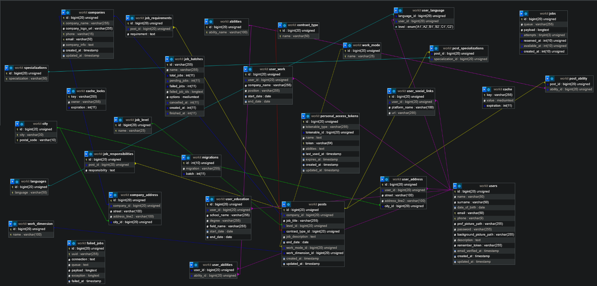

## ⚙️ Backend Documentation

The backend section is designed as an independent, stateless REST API responsible for business logic, user authentication, and database communication. Decoupling the backend from the frontend allows for easier scaling and opens the door to integrating a mobile application in the future.

### 🛠 Technologies & Architecture
* **PHP & Laravel:** The core technologies powering the server logic. Built-in routing, controllers, and middleware mechanisms are used to elegantly manage HTTP requests.
* **MySQL:** A relational database storing information about users, job offers, and applications. The database structure is managed through Migrations and populated with dummy data using Laravel's Seeders and Factories.
* **JWT (JSON Web Tokens):** The API authentication mechanism. Upon successful login, the server generates a JWT, which is required to access protected resources (e.g., adding new job offers, editing profiles). A dedicated middleware handles this by validating the token present in the `Authorization` header.
* **Architecture:** The project follows the MVC (Model-View-Controller) pattern in an API context, where the "views" are JSON responses. Form Requests are also utilized to validate incoming data before it reaches the controller, improving security and code readability.

### 🗄️ Models & Database Relationships

The backend heavily relies on Laravel's Eloquent ORM to interact with the MySQL database. The database architecture is designed with clear relationships between entities, ensuring data integrity and logical structuring.

Key models and their relationships include:
* **User Model:** Represents registered users (both candidates and employers). 
  * *Relationship:* A `User` `hasMany` (posiada wiele) `JobOffers` (if acting as an employer) and `hasMany` `Applications` (if acting as a candidate).
* **JobOffer Model:** Represents the core entity of the platform—a job advertisement.
  * *Relationship:* A `JobOffer` `belongsTo` (przynależy do) a specific `User` (the creator/employer) and `belongsTo` a `Category` (e.g., Frontend, Backend, DevOps).
* **Category / Tag Models (Optional/Extendable):** Used to filter and group job offers logically. A `JobOffer` can `belongToMany` `Tags` (many-to-many relationship) to define required tech stacks.

### ⚡ Query Optimization & Data Serialization

To ensure the REST API remains highly performant and responsive, specific architectural patterns and optimizations were implemented:

* **Eager Loading (Solving the N+1 Problem):**
  When fetching lists of job offers, fetching the related data (like the user who posted it or the category) for each item individually would result in the classic "N+1 query problem," severely degrading database performance. 
  To optimize this, Eloquent's Eager Loading is utilized. By using the `with()` method (e.g., `JobOffer::with(['user', 'category'])->get()`), the backend fetches all necessary related models in just two or three optimized SQL queries, rather than executing a new query for every single job offer in the loop.

* **API Resources (JSON Serialization):**
  Instead of returning raw database models directly to the frontend, the project utilizes Laravel API Resources (`JsonResource`). This layer acts as a data transformer, allowing fine-grained control over what data is exposed in the JSON response. It ensures that sensitive information (like user passwords or internal database IDs) is hidden and that date formats or nested relationships are structured cleanly and consistently for the React frontend to consume.

* **Pagination:**
  To handle a potentially large volume of job advertisements, endpoints returning lists (like `/api/jobs`) implement database-level pagination. This limits the payload size of the HTTP response and significantly speeds up rendering times on the client side.
